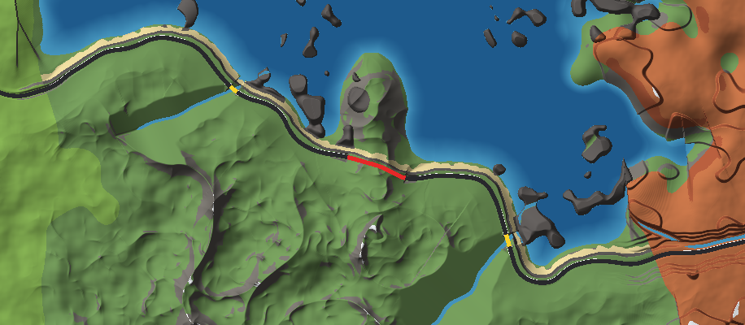
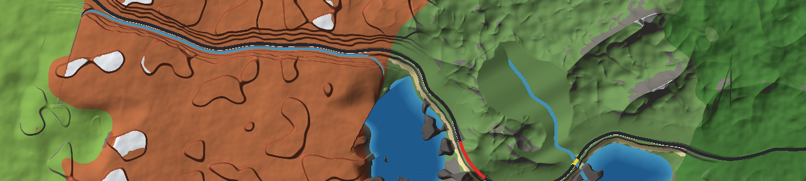
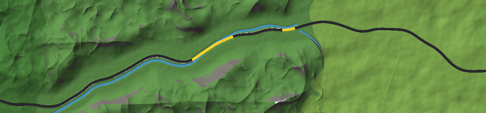
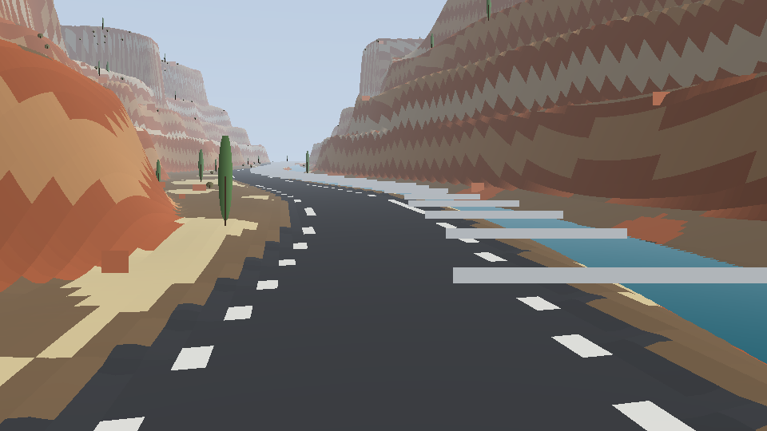
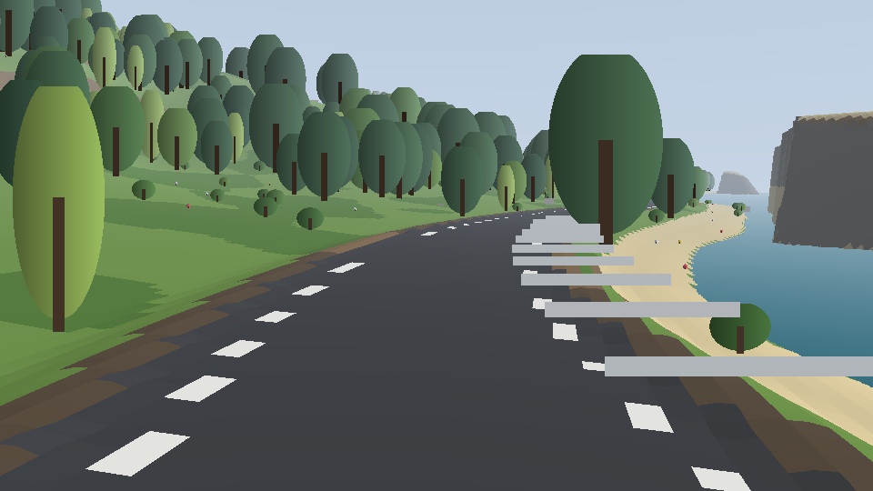
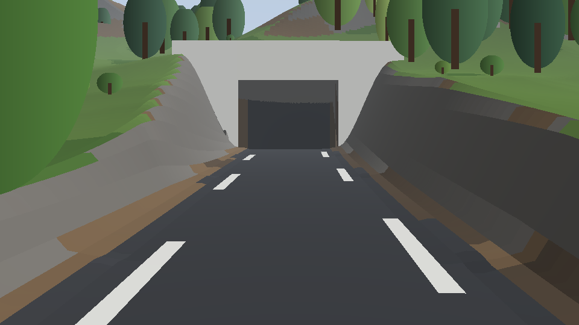

# Infinite Scenic Road (Roblox)

A [slowroads.io](https://slowroads.io)-style endless driving game for Roblox. One road goes on forever, and the world around it is generated as you drive:

- **Mountains** with snowy peaks, rock cuts and **tunnels** through the ridges
- **Coastal cliff roads** above the ocean, with beaches, coves, sea stacks, headland tunnels and bridges over river mouths
- **Canyons**: tiered red-rock walls with rock strata, mesas and buttes, a river along the canyon floor, and big **bridges** over gorges
- **Lakes** with sandy shores and islands, beside a flat lakeside road
- **Rivers**: river valleys where the river winds beside the road and crosses under it, plus rivers that cross the road at an angle
- **Forests** (some sections in autumn colours) and **meadows** with flowers
- **Trees and plants** matched to each region: pines, snowy pines, oaks, birches, wind-swept coastal cypresses, cacti, bushes, dry shrubs, flowers and rocks
- **Road furniture**: guard rails wherever the road drops away or runs along water, bridge parapets, lit tunnels with portals, delineator posts, and signs (curve warnings, chevrons around sharp bends, tunnel ahead, speed limits, falling rocks, deer crossings, km markers, and green "Entering ..." signs for every region)

It also includes a drivable car, a slowroads-style **autodrive**, chase, hood and **cinematic roadside** cameras, a day/night cycle, and a "km driven" leaderboard.

| Coast: cliffs, beach, sea stacks, a headland tunnel (red) and river bridges (yellow) | Canyon, then coast | River valley: the river crosses under the road on bridges |
|---|---|---|
|  |  |  |

| Canyon floor with river | Lakeside road | Tunnel portal |
|---|---|---|
|  |  |  |

> These images are **not in-game screenshots**. They come from the offline tools in `tools/`, which run the real generator code and draw its output with a simple software renderer. Roblox will look better: real lighting, water, smooth terrain and actual 3D trees.

---

## Getting started

### Option A: open the place file
1. Open **`InfiniteScenicRoad.rbxl`** in Roblox Studio.
2. Press **Play**.

The place is already set up (streaming off, Future lighting, spawn platform).

### Option B: Rojo
```bash
rojo build default.project.json -o InfiniteScenicRoad.rbxl   # build a place file
# or, for live syncing into Studio:
rojo serve
```

### Required place settings
If you copy the scripts into your own place instead:
- **Workspace.StreamingEnabled = false.** The world is generated on each client, and streaming would delete that client-made terrain.
- Lighting.Technology = Future (recommended).
- Put `src/shared` in ReplicatedStorage as a folder named `InfiniteRoad`, `src/client` in StarterPlayerScripts as a LocalScript, and `src/server` in ServerScriptService as a Script (see `default.project.json`).

## Controls

| | Keyboard | Gamepad | Touch |
|---|---|---|---|
| Drive / brake / reverse | W / S (or arrows) | RT / LT | GAS / BRAKE |
| Steer | A / D (or arrows) | Left stick | ◀ ▶ |
| Handbrake | Space | A | |
| Autodrive | F | X | AUTO |
| Camera (chase, hood, cinematic) | C | Y | CAM |
| Look around | Right-drag, wheel to zoom | Right stick | |
| Put the car back on the road | R | B | RESET |
| Time of day | T | D-pad up | |
| Hide HUD | H | D-pad down | |

Pressing any drive key turns autodrive off. A car that flips or ends up in the water is put back on the road automatically.

---

## How it works

### One world per player
Every client generates its own copy of the world from a **shared seed** that the server picks, so everyone on a server drives the same road. The server does almost nothing (it picks the seed and runs the leaderboard). This keeps terrain replication off the network and lets each client move its own floating origin. Other players' avatars are hidden, because they are driving in their own copy of the world.

### The road (`src/shared/RoadPath.luau`)
- The road is stored as samples every 4 studs. The heading comes from layered noise and is limited to a minimum turn radius.
- The heading always stays within ±74° of +X. That guarantees the road never crosses itself, and that samples are sorted by X, so finding the nearest point on the road is a quick binary search followed by a small scan.
- Elevation starts from a target (terrain height, or a region-specific level such as cliff shelf height or lake level). That target is gaussian-smoothed and capped at a 7.5% grade. Because the road is smoothed while the ground is not, ridges come out higher than the road (tunnels) and valleys lower (bridges).
- Along the finished road, a streaming run detector turns raw measurements into clean runs, with a minimum length, merged small gaps and padded ends:
  - **tunnel** where there is more than 34 studs of rock above the road,
  - **bridge** where the road is more than 20 studs above the ground or crosses water,
  - **guard rail** where the ground next to the road drops away or there is water close by.

### Regions and landforms (`Sections.luau`, `TerrainSampler.luau`)
- The road is divided into **sections** (Meadow, Forest, Mountains, Coast, Canyon, Lake, RiverValley), each 2–6k studs long, which cross-fade over 900 studs. They are generated lazily from the seed, and each one gets a name ("Redrock Canyon", "Lake Serene", ...).
- Each region has its own height function, defined relative to the road (distance to the side `d`, arc length `s`). Mountain relief is damped close to the road, so the road runs along valleys with the peaks beside it.
- **Crossings** are landforms laid across the road at an angle: *ridges* force tunnels, and *rivers* and *gorges* force bridges.
- Then the road corridor is applied: cuts and embankments with slopes that suit the material, tunnel voids with an arched profile (plus cut-and-cover where the rock is thin), and natural ground left under bridges.

### Streaming (`src/client/ChunkManager.luau`)
- The world is built in 128×128-stud chunks around a point just ahead of the car. Each chunk gets voxel terrain, road parts and decoration.
- All work runs in one coroutine with a per-frame time budget (7 ms while driving), so it never causes a big frame spike.
- Trees switch between a one-part far version and a full near version. Placement is seeded per cell, so nothing moves when a chunk changes detail.
- Terrain columns more than 300 studs from the road are interpolated from an 8-stud grid, which is about 3.5× faster. Near the road everything is sampled exactly.
- **Floating origin:** once the car is 16k studs from the Roblox origin, the world is recentred. Terrain is copied to its new place over a few frames (out of sight), then every part, the car and the camera shift in a single frame. That keeps physics precise however far you drive.

### The car (`Car.luau`)
A raycast-suspension car. Each wheel casts a ray, and a spring/damper plus tyre friction are applied through a VectorForce. Grip is limited by a friction circle, steering lock shrinks with speed, the handbrake lets the rear slide, the car holds itself on hills when stopped, and there are headlights (at night) and brake lights. Autodrive steers with pure pursuit and slows for bends ahead based on their curvature.

### Project layout
```
src/shared/     ReplicatedStorage.InfiniteRoad (pure Luau, no DataModel access)
  Config.luau          every tunable
  Noise.luau           seeded Perlin / fbm / ridged noise (math.noise)
  Sections.luau        regions, names, crossings
  RoadPath.luau        the infinite road: path, elevation, tunnels/bridges/rails, projection
  TerrainSampler.luau  height model per column
  World.luau           wires the above together for one seed
src/client/     StarterPlayerScripts.InfiniteRoadClient
  init.client.luau     entry point
  ChunkManager.luau    streaming + floating origin
  TerrainBuilder.luau  voxels + materials per chunk
  RoadBuilder.luau     road, markings, rails, bridges, tunnels, signs
  Decorator.luau       vegetation placement
  Props.luau           procedural trees, rocks, signs (no assets needed)
  Car.luau, AutoDrive.luau, CameraController.luau, Input.luau, Hud.luau, Atmosphere.luau
src/server/     ServerScriptService.InfiniteRoadServer (seed + leaderboard)
tools/          offline tests and preview renderers (Lune + Python)
```

## Tuning

Everything lives in `src/shared/Config.luau`. The most useful settings:

| Setting | What it does |
|---|---|
| `Seed` | 0 = random per server. Set a number to always get the same road. |
| `Road.MinRadius`, `Regions.*.Twist` | how curvy the road is |
| `Road.MaxGrade`, `Road.ElevationSmoothing` | how hilly the road is; less smoothing means fewer tunnels and bridges |
| `Tunnel.CoverThreshold`, `Bridge.GapThreshold` | when a cut becomes a tunnel, and when an embankment becomes a bridge |
| `Regions.*.Weight` / `Length` | how often each region appears and how long it lasts |
| `Decor.Density` | trees per region |
| `World.TerrainRadius`, `FrameBudget` | view distance and how much time per frame generation may use (lower both for weaker devices) |
| `Car.*` | top speed, acceleration, grip, suspension |
| `Sky.DayLengthMinutes` | 0 freezes time |

## Offline tests

The generator and the chunk builders are tested outside Roblox with [Lune](https://github.com/lune-org/lune), which provides Luau, Luau's own `math.noise`, and Roblox's real class and property definitions. Invalid property names or types fail the tests.

```bash
lune run tools/check_syntax                 # every source file compiles; the place file has the right hierarchy and settings
lune run tools/test_road [seed] [studs]     # road invariants: monotonic X, min radius, max grade, flags, determinism, projection
lune run tools/test_chunks [seed]           # full chunk pipeline: voxels, road, tunnels, bridges, decoration, rebase
lune run tools/curve_stats [seed]           # curve radius distribution
lune run tools/list_sections [seed]         # region sequence

# pictures (needs python3 with numpy + pillow)
lune run tools/render_map 12345 0 12000 1400 10 map.bin && python3 tools/render_map.py map.bin map.png
lune run tools/render_view 12345 3000 view.bin && python3 tools/render_view.py view.bin view.png
```

## Limitations and notes
- **Not yet playtested in Roblox Studio.** The generator, chunk building and every instance/property it creates run in the offline tests above. Things only the engine can show (how the car handles, camera feel, lighting, how smooth terrain meshes the voxels, frame rate on real devices) still need a playtest, and the car numbers in `Config.Car` will probably need tuning.
- Players on the same server share a seed but don't see each other, because each world is local to its player.
- The road starts at a "ROAD ENDS" barrier behind the spawn point. It's infinite forwards only.
- Generation runs on the client. On weak phones, lower `World.TerrainRadius` (for example to 600) and `World.FarDecorRadius`.
